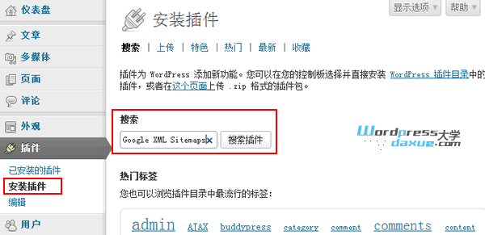
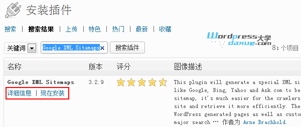
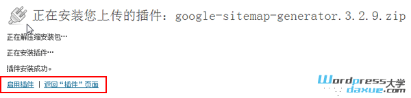

## WordPress 安装插件

安装插件和安装主题类似，也是有3种常用方法：

> 安装插件之前去人wp-content的目录的权限都为777，特别是upgrade目录

### 方法一：在线搜索安装

访问后台 – 插件 – 安装插件，输入关键词搜索

浏览搜索结果，进行安装

注：一般建议安装已提交到[WordPress插件库](http://wordpress.org/plugins/)的插件，而且是最近更新过的（建议不要安装2年多没有更新的插件）

### 方法二：在线上传安装插件

访问后台 – 插件 – 安装插件 – 上传，选择本地 .zip 格式的插件包

安装成功

### 方法三：通过FTP上传安装

如果没办法通过上面的方法安装，那你可以通过FTP连接主机空间，将创建包解压后，上传到 _/wp-content/plugins_ 目录：

### 启用和管理插件

插件安装好以后，访问后台 – 插件 – 已安装的插件，就可以启用插件了

你也可以在这里停用已启用的插件

注：有些插件启用以后还需要进行相关设置，每个插件的设置选项不一样，在此就不演示了。
