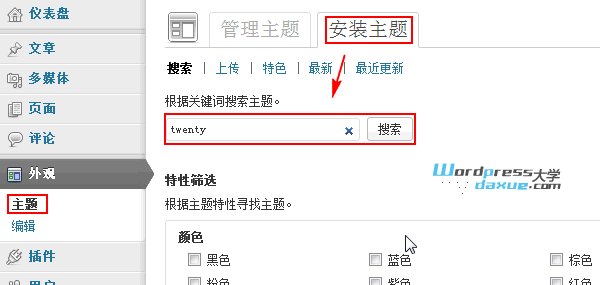
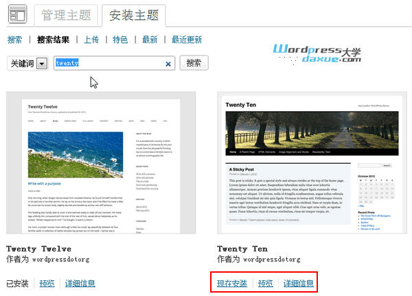
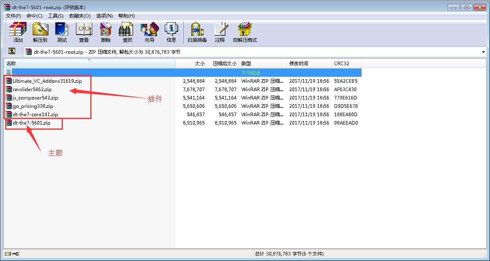
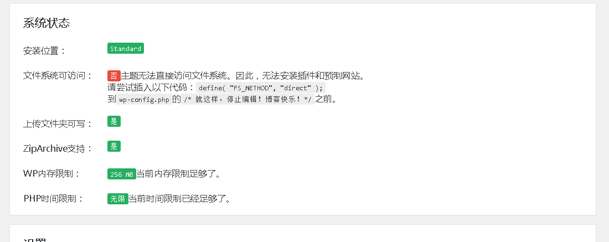
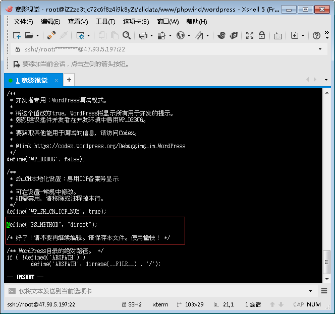
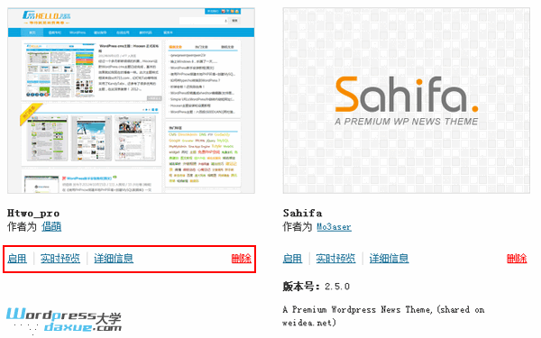

## WordPress安装主题

WordPress可以通过3种常见的安装方法来安装

### 方法一：在线搜索安装

访问后台 – 外观 -主题 – 安装主题，输入主题关键字，搜索

浏览搜索结果，进行安装

注：这里搜索的主题，都是主题作者提交到[WordPress主题库](http://wordpress.org/themes/)的主题，经验告诉我们，对于国内用户而言，在这里很难快速找到我们想要的主题，所以一般不推荐，除非你想要的主题已经已提交到主题库了。

### 方法二：通过FTP上传主题

如果你没办法通过上面的方法安装主题，你可以通过FTP连接主机空间，然后进入到网站的 _/wp-content/theme_ 目录，将本地解压好的主题文件上传到这里

### 方法三：在线上传主题文件安装

这是用的比较多的方法，前提是主题包必须以 .zip 格式打包。在后台 – 外观 – 主题 – 安装主题 – 上传，选择主题包，然后安装

如果出现下图缺少style.css错误：

是因为上传的zip不正确,确认上传的为主题压缩包,如下图:

安装成功，如下

安装成功后信息显示权限问题,根据提示去修改wp-config.php,如下图:

修改完成后,可以安装插件等

### 启用和管理主题

安装好主题以后，访问后台 – 外观 – 主题，就可以看到刚才安装的主题，你可以查看“详细信息”，“预览”或“启用”主题。如果要更换主题，也是在这里启用新主题即可。

启用主题以后，可能需要进一步设置主题。不同的主题所需要的设置不一样，所以这里就不演示了。
