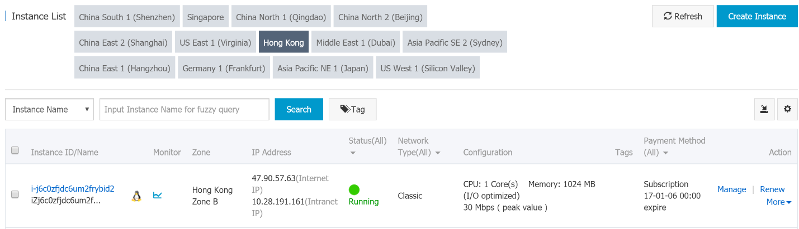

## [阿里云上部署 WordPress 实例](https://www.baidu.com/link?url=jgsrSL6OZ_nTJamvO0rwW11OvQ2T-c-hEGymMQNjeAdbnU46nFtGPT2pH3WFJTrfoE2TwiihoU20c9DA9nNOyD90W9ItBVEPbveZk51HZIrBmGxDJKy31RR-hpZTbKakzdUMmk4Lq8WXhEJkQ4o-2a&ck=7776.18.112.450.244.362.143.764&shh=www.baidu.com&sht=baidu&wd=&eqid=96f74aa5000071ff000000065a1d087d)

### 概述

本博客介绍如何在**阿里云** ECS Ubuntu 14.04 上使用 Apache Web 服务器设置 WordPress 实例。

### 关于 WordPress

WordPress 是全球最受欢迎的内容管理系统 (CMS) 之一，主要用于管理在线博客和网站。多年来 WordPress 一直保持着令人难以置信的用户采用率，是快速启动和运行网站的理想选择。WordPress 让您可以通过 PHP 处理在 MySQL 后端构建网站。

### 准备工作

您需要完成配置服务器的几个重要步骤，之后才可以进行部署。您首先需要创建一个具有 sudo 权限的非根用户，并在您的**阿里云** ECS 实例上**安装**一个 LAMP（Linux、Apache、MySQL 和 PHP）堆栈

### 部署 WordPress

现在，让我们浏览一下在**阿里云** ECS 上部署 WordPress 的步骤。

### 第 1 步： 使用 ECS 启动 Linux 实例

执行以下步骤为您的 Linux 计算机启动**阿里云** ECS 实例：

1.通过**阿里云**管理控制台 ([https://ecs.console.aliyun.com](https://ecs.console.aliyun.com/)) 登录您的帐户。登录后，您将被重定向到以下仪表板。


2.导航到“产品和服务”部分下的“弹性计算服务”。您将被重定向到 ECS 概述仪表板。单击侧边栏菜单中的“实例” 以导航到“实例”仪表板。


3.创建实例后，根据您的需求选择首选付款方式。您可以决定选择入门包或高级购买。选择“数据中心区域”和“可用区域”以启动 ECS 实例。如果指定了“区域”但未指定“可用区域”，则实例将被放置在默认区域中。


4.在“选择实例类型”下，选择“生成”。不同的生成类型提供不同的配置和计算能力。根据需要选择“网络类型”，可以选择“经典网络”或 “专有网络”。然后，选择“网络计费类型”。


5.选择 Ubuntu 或其他 Linux 服务器镜像来启动 Linux 服务器。此外，根据您的需求使用下拉选项卡选择映像的版本，然后选择所需的存储类型。


6.此时将显示通过设置密码来设置服务器安全性的选项。您可以选择设置密码，也可以稍后在管理控制台进行设置。


7.查看您购买的配置的概述，然后单击“激活”以确认并启动服务器。


8.您启动的实例将显示在“实例”部分




这就是如何使用管理控制台轻松启动采用 Linux 操作系统的 ECS 实例的过程。

### 第 2 步： 为 WordPress 创建 MySQL 数据库和用户

相关**阿里云**产品： **阿里云**云数据库 RDS 版  

WordPress 利用关系数据库来存储和管理网站和用户数据。我们将在博客中使用 MySQL，但对于生产环境，我们可以使用**阿里云**云数据库 RDS 版，这是一个按需提供的数据库服务，将您从数据库管理的繁杂工作中解放出来，从而拥有更多时间专注于您的核心业务。云数据库 RDS 版是在 MySQL、SQL Server 和 PostgreSQL 上提供的一个即时可用的服务。RDS 处理常规数据库任务，如配置、修补、备份、恢复、故障检测和修复。  

**安装**了 MySQL 后，我们还需要为 WordPress 创建数据库和用户。  

开始时，请使用以下命令登录 MySQL 根帐户：  

```
Welcome to aliyun Elastic Compute Service! root@iZt4n0drrwgfgq36vp3glgZ:~# mysql - u root -p
```

在这里，您需要输入您在**安装**软件时设置的 MySQL 根帐户的密码。输入密码后，您将获得一个 MySQL shell。  

让我们同时为 WordPress 创建一个单独的数据库。您可以根据您的喜好随意命名，但在这里我们将其命名为 “wordpress”。使用以下命令：   

```
mysql> CREATE DATABASE wordpress;
```

###

**\*注意：** 每个 MySQL 语句应以分号 (;) 结尾。请确保不要因为遗漏分号造成任何错误。  

现在，为了在我们的新数据库上进行操作，我们需要创建一个 MySQL 专用用户帐户。从管理和安全角度出发，建议创建单功能数据库和帐户。  

让我们将新帐户命名为 “wordpress user”，并为密码字段指定 “password”。请谨慎选择用户和密码字段的值。现在，通过以下命令创建用户：  

```
mysql> CREATE USER wordpressuser@localhost IDENTIFIED BY ‘password’ ;  Query OK, 0 rows affected (0.00 sec)
```

现在，我们即有了一个专门用于 WordPress 的数据库和用户帐户。但是，用户尚未拥有访问数据库的权限。要对用户帐户授予数据库的访问权限，请输入以下命令：   

```
mysql> GRANT ALL PRIVILEGES ON wordpress.* TO wordpressuser@localhost;
```

此命令向用户帐户授予数据库访问权限。现在，要刷新权限以让当前 MySQL 实例得知最近所做的权限更改，我们必须输入以下命令：  

```
mysql> FLUSH PRIVILEGES;
```

现在，这部分就完成了。按如下方式在 MySQL 提示符后使用 “exit”：   

```
mysql> exit
```

您现在即可返回到您的常规命令提示符。

### 第 3 步： 下载 WordPress

接下来，从项目网站下载实际的 WordPress 文件。  

幸运的是，WordPress 总是将最近最稳定的软件版本链接到同一个 URL。使用以下命令获取最新版本的 WordPress：  

root@iZt4n0drrwgfgq36vp3glgZ:~# wget http://wordpress.org/latest.tar.gz```

```

这会将包含 WordPress 文件的归档目录内容的压缩文件下载到我们的主目录。  

使用以下命令提取重建 WordPress 目录所需的文件：  

```
root@iZt4n0drrwgfgq36vp3glgZ:~# tar xzvf latest.tar.gz
```

此命令在您的主目录中创建一个名为 “wordpress” 的目录。   

现在，执行这些命令后，我们将下载更多所需的软件包。在您更新您的本地包索引后，您可以直接从 Ubuntu 的默认存储库中获取这些资源包：  

```
root@iZt4n0drrwgfgq36vp3glgZ:~# sudo apt-get update root@iZt4n0drrwgfgq36vp3glgZ:~# sudo apt-get install php5-gd libssh2-php
```

这有助于利用映像，还有允许您使用 SSH 登录凭据**安装**插件和更新您的网站内容。  

### 第 4 步： 配置 WordPress

稍后，我们将通过一个 Web 界面进行大部分的配置。但是，我们需要在命令行上进行一些操作，然后才能启动和运行 WordPress。  

让我们通过以下命令进入我们刚刚解压的 WordPress 目录：  

```
root@iZt4n0drrwgfgq36vp3glgZ:~# cd ~/wordpress
```

默认情况下，随附与我们需要的配置非常匹配的样本配置文件。但是，为了便于 WordPress 识别文件，我们需要将其复制到默认的配置文件位置。为此，请使用以下命令：  

```
root@iZt4n0drrwgfgq36vp3glgZ:~/wordpress# cp wp-config-sample.php wp-config.php
```

既然我们有一个配置文件要使用，让我们在文本编辑器中打开它：  

```
root@iZt4n0drrwgfgq36vp3glgZ:~/wordpress# vi wp-config.php
```

如前所述，此文件对保存我们的数据库信息的参数进行一些修改，可满足我们的大部分需求。搜索 DB_NAME、DB_USER 和 DB_PASSWORD 的设置以便 WordPress 正确连接到所创建的数据库并进行身份验证。我们需要使用所创建的数据库的信息填充这些参数。它将显示如下：  


  


只更改突出显示的值，并在完成后保存并关闭文件。

### 第 5 步： 将文件复制到文档根目录

配置应用程序后，我们必须将它复制到 Apache 的文档根目录，我们可以在此将其提供给我们网站的访问者  

使用 rsync 命令可以轻松可靠地在目录之间传输文件。这样可以保留权限，并提供了数据完整性功能。   

文档根位置为 /var/www/html/。我们可以通过键入以下内容来传输 WordPress 文件：  

```
root@iZt4n0drrwgfgq36vp3glgZ:~/wordpress# sudo rsync -avP ~/wordpress/ /var/www/html/
```

这将以安全的方式将您解压缩的目录中的所有内容复制到文档根目录。  

然后，转到文档根目录，对权限进行一些最后的更改。   

```
root@iZt4n0drrwgfgq36vp3glgZ:~/wordpress# cd /var /www/html
```

更改文件的所有权以提高安全性。我们希望将用户所有权指定给您计划用于与网站交互的常规非根用户（具有 sudo 权限）。这可以是常规用户，也可以使我们可以创建另一个用户。   

然后，从根帐户执行所有操作。在上传目录中指定正确的所有权，以便所有者可以将各种内容上传到您的网站。目前，权限非常受限。让我们首先在文档根目录的 wp-content 目录下手动创建上传目录，使其成为我们内容的父目录：  

```
root@iZt4n0drrwgfgq36vp3glgZ:/ var /www/html# mkdir /var/www/html/wp-content/uploads
```

### 第 6 步： 通过 Web 界面完成**安装**

相关**阿里云**产品： 云解析  

现在您已经完成软件配置，并且文件已经准备就位，那么我们将通过 Web 界面完成**安装**。  

在 Web 浏览器中，转到服务器的域名或公共 IP 地址：  

[http://server_domain_name_or_IP](http://server_domain_name_or_ip/)  

在 WordPress 初始配置页面上，创建一个初始管理员帐户：  


填写所需的信息和您要创建的管理帐户。（注意： 用户必须记下他/她的密码才能重新登录，因为在此阶段重置选项将不可用，因为电子邮件 ID 尚未配置。）  

完成后，单击底部的**安装**按钮。  


一旦您填写完您的帐户信息，您将被定向到 WordPress 界面：


您的 WordPress 实例现在已启动并在您的 ABC ECS (Ubuntu 14.04) 上运行。

### 最后一步（可选）


最后一步（可选）  

相关**阿里云**产品： **阿里云** Web 应用防火墙, **阿里云**云监控  

我们可以添加一些附加层，以提高我们的网站在生产环境中的可靠性和安全性：  

我们还可以通过对我们正在运行的数据库拍摄快照来进行备份，从而消除数据库故障。  

[**阿里云** Web 应用防火墙](https://intl.aliyun.com/zh/product/WAF?spm=a3c0i.7911826.634574.16.Wj2hjj)可用于防范针对 Web 发起的攻击，包括 SQL 注入、XSS、恶意 BOT、命令执行漏洞和其他常见的 Web 攻击。**阿里云** Web 应用防火墙过滤掉大量的恶意访问尝试，并缓解 HTTP/HTTPS 的 Flood 攻击对服务器造成的性能影响。  

[**阿里云**云监控](https://intl.aliyun.com/zh/product/cloud-monitor?spm=a3c0i.7911826.634574.16.Wj2hjj)可让您深入了解您的**云部署**。云监控对关键度量（如 CPU 利用率和时延）提供高级分析，您还可以针对业务需求自定义度量。
